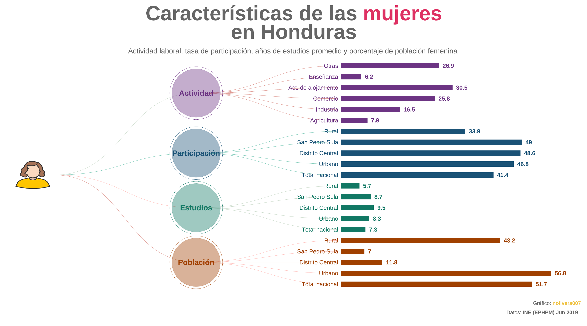
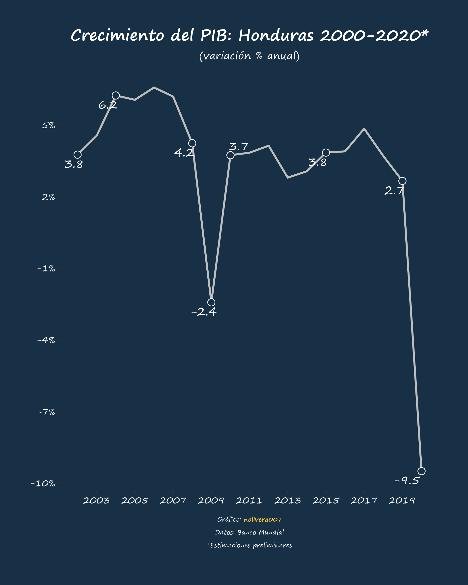

<!-- README.md is generated from README.Rmd. Please edit that file -->

```{r, include = FALSE}
knitr::opts_chunk$set(
  collapse = TRUE,
  comment = "#>",
  warning = F, 
  message = F, 
  error = F,
  fig.path = "figures/README-",
  out.width = "100%"
)
```

# Data visualization

Una colección de visualizaciones y código de gráficos hechos con R. A continuación se proporciona una lista de las visualizaciones:

### Mapa Covid-19 del total de casos confirmados: [código](map_covid19_dept_hn)


### Covid-19 en Centroamérica: [código](line_covid19_ca)


### Caraterísticas de las mujeres en Honduras: [código](woman_hn)


### Crecimiento del PIB Honduras 2000-2020: [código](pib_hn)
