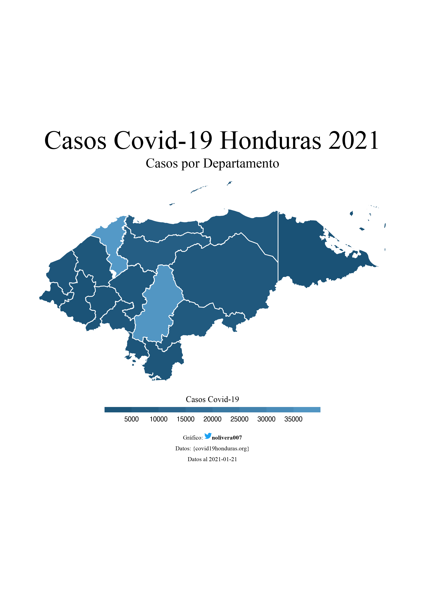
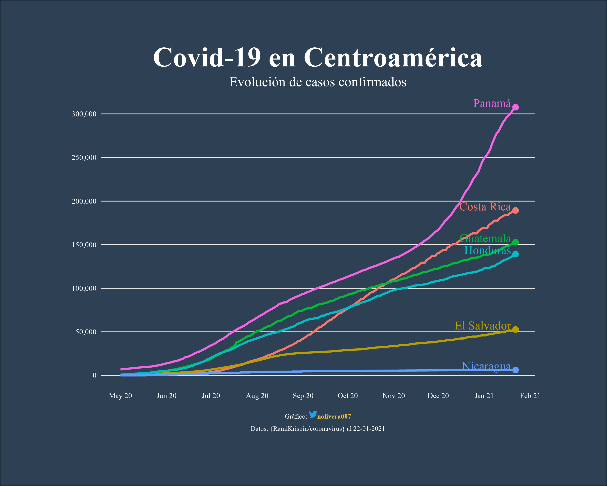
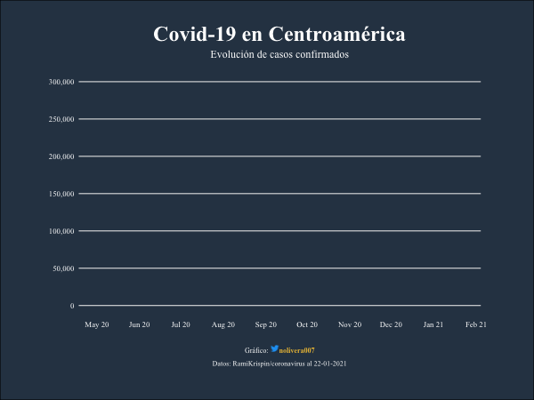

# Data visualization
Código de gráficos hechos con R.

<<<<<<< HEAD
| <!-- --> | <!-- --> | <!-- --> |
| --- | --- | ---|
| [Mapa Covid-19](map_covid19_dept_hn) |  |  |
| [Covid-19 en Centroamérica](line_covid19_ca) |  |  |