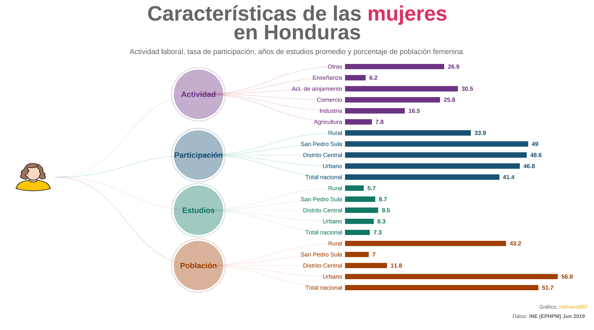
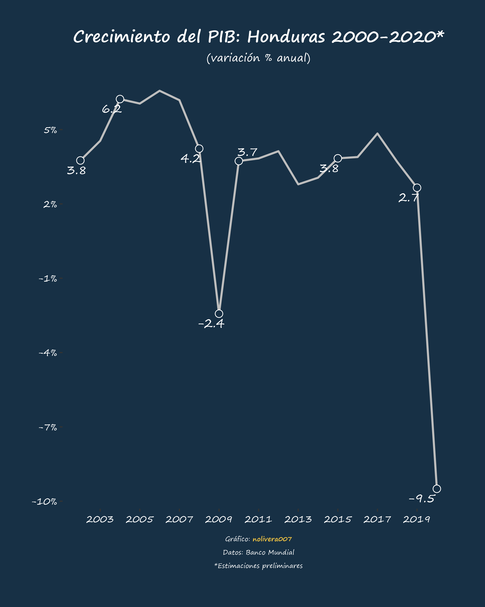

# Data visualization
Código de gráficos hechos con R.

| <!-- --> | <!-- --> | <!-- --> |
| --- | --- | --- |
| [Mapa Covid-19](map_covid19_dept_hn) |  |  
| [Covid-19 en Centroamérica](line_covid19_ca) |  |
| [Caraterísticas de las mujeres en Honduras](woman_hn) |  |
| [Crecimiento del PIB: Honduras 2000-2020](pib_hn) |  |